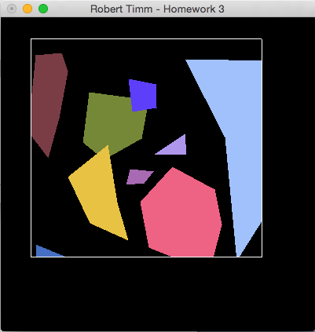

## CSCE-441-Project-3 Scan Conversion Algorithm

### Notes
Received an A on this assignment. This implementation utilizes scissoring, which is a post processing sequence that ignores pixels to be rendered outside of the clipping window. In future implantations this process should be handled in the active edge table. 

### Compile & Run
* Navigate into this repo after cloning it to your local development machine
* Type `make`
* Run with `./main`

### Controls
* Add points to the screen by left-clicking anywhere in the GUI with your mouse. Add the final point by right clicking.
* Press `c` to turn the clipping window on and off. Click and drag with your left mouse button to specify a new clipping window.

### Guidelines
* To draw polygons, the user should specify points using the left mouse button.  Each point where the user presses down will give the next point (in order) on the polygon.  The final point in the polygon will be specified by pressing the right mouse button.  So, a triangle would be described by two left clicks and one right click.  The user may define up to 10 polygons, each with at most 10 vertices (before clipping). 
* The polygon should be scan-converted.  Each polygon should be drawn in a different color.  You should use an active edge table/list approach for this.
* To clip, the user should press the ‘C’ key.  Once this key has been pressed, no more polygons can be entered. 
* The user should specify the clipping region by clicking and dragging (with the left mouse button) a rectangle in the window.  One corner of the rectangle is specified by where the button is pushed down, the opposite corner by where it is released.  The clipping rectangle should be highlighted (i.e. the 4 edges of the rectangle drawn) as it is being dragged (all the polygons currently being displayed should still be shown).
* Once the rectangle has been set, the polygons should be clipped, and the clipped results displayed.  You should not use scissoring, and will lose significant points if you do so.
* The user should be allowed to change the clip region as many times as desired.  In each case, the original polygons entered should be used for clipping – not the already-clipped polygons.
* You may use a polygon clipping algorithm that leaves extraneous edges for concave polygons being clipped.

### Screenshots

Example of various polygons created by the user

Example of the previous polygons clipped using the implementation of the scanline conversion algorithm

